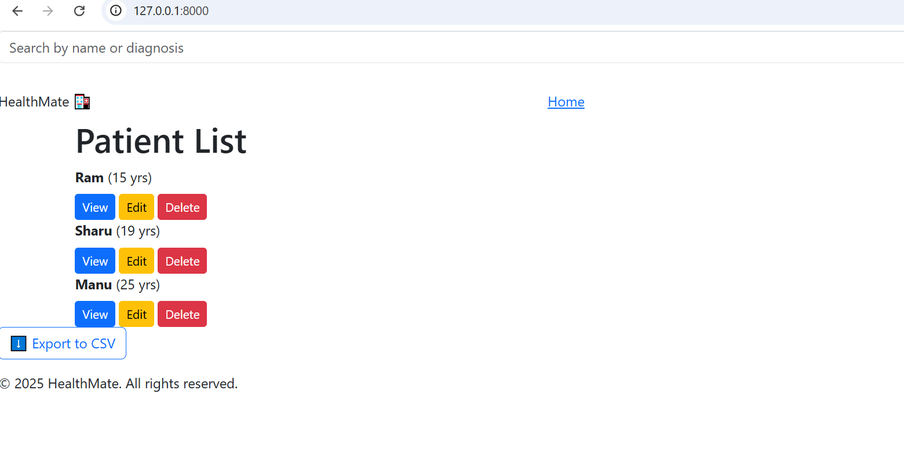
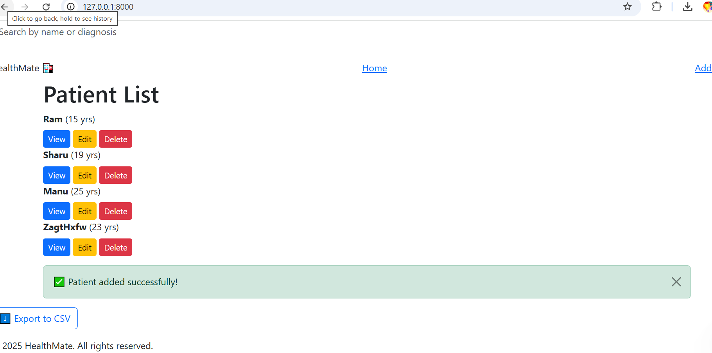
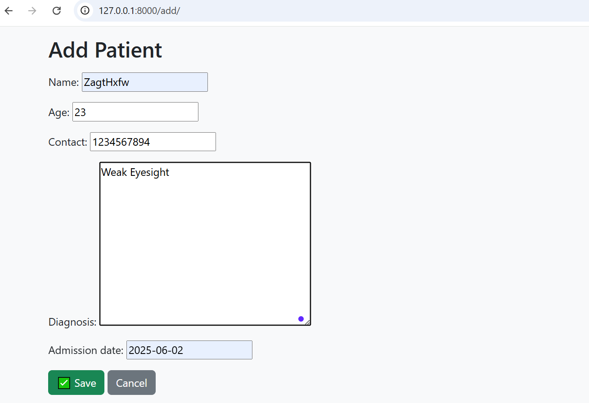

# 🏥 HealthMate – Patient Records Management System

HealthMate is a modern Django-based web application designed to help clinics and small hospitals manage their patient records efficiently. It supports adding, editing, deleting, searching, and exporting patient data – all within a beautiful and responsive UI.

---

## 🚀 Features

| Feature                | Description                                                             |
|------------------------|-------------------------------------------------------------------------|
| 🔍 Search/Filter        | Search patients by name, age, or diagnosis.                            |
| ✅ Toast Feedback       | See real-time success/failure messages using toast alerts.             |
| 🧾 CRUD Operations      | Add, view, update, and delete patient records easily.                  |
| 📤 Export               | Export patient records as Excel or PDF.                               |
| 🎨 Responsive UI        | Stylish, clean, and mobile-friendly user interface.                   |

---

## 🖥️ UI Screenshots

### 📋 Patient List View
<<<<<<< HEAD


### ➕ Add Patient


### 📄 Patient Detail / Export Option


---

## 🛠️ Tech Stack

- **Frontend**: HTML, CSS (custom styling), Bootstrap
- **Backend**: Django 5.x
- **Database**: SQLite3 (default)
- **Libraries**: `openpyxl`, `reportlab`, `crispy-forms`, `django-toast`, etc.
=======
>>>>>>> e57c4b9 (Update README with screenshots section)

---

<<<<<<< HEAD
## 🧩 How to Run Locally

=======

C:\Users\lenovo\OneDrive\Desktop\health_records\health_records\screenshots\image1.png

### ➕ Add Patient

C:\Users\lenovo\OneDrive\Desktop\health_records\health_records\screenshots\image2.png

### 📄 Patient Detail / Export Option

C:\Users\lenovo\OneDrive\Desktop\health_records\health_records\screenshots\image3.png

---

## 🛠️ Tech Stack

- **Frontend**: HTML, CSS (custom styling), Bootstrap
- **Backend**: Django 5.x
- **Database**: SQLite3 (default)
- **Libraries**: `openpyxl`, `reportlab`, `crispy-forms`, `django-toast`, etc.

---

## 🧩 How to Run Locally

>>>>>>> e57c4b9 (Update README with screenshots section)
1. **Clone the repository**
   ```bash
   git clone https://github.com/Prabhanshiyadav/healthmate-django.git
   cd healthmate-django
